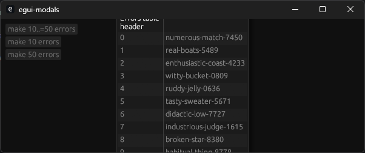
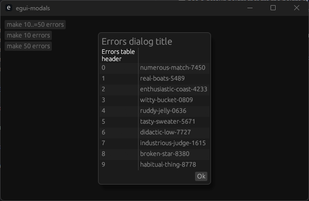

# egui-modals

## About

This repo is a test repo for working out how to create a modal that fulfills a set of requirements.

## Requirements

* [ ] has a maximum width of 80% of the OS windows's internal width.
* [ ] has a minimum width of 50% of the window width.
* [ ] is 80% of the OS window's internal width by default.
* [ ] has a maximum height of 80% of the OS window's internal height.
* [ ] has a minimum height of 20% of the OS window's internal height.
* [ ] is resizable.
* [x] has title.
* [ ] is movable by dragging the title area of the modal.
* [x] has a table with a list of errors.
* [ ] the table is vertically scrollable.
* [ ] the table resizes to fit the size of the modal.
* [x] has a row of buttons at the bottom, right justified. (e.g. 'ok' + 'cancel')
* [ ] has a default height that fits the height of the height of the label + height of the minimum height of the table +  height of the buttons.
* [ ] pressing return or enter should be the same as clicking 'Ok'
* [ ] pressing ESC should be the same as clicking 'Cancel'

## Current state

Assistance required!

## Failures

### Failure 1

When there's too many errors:

* the dialog is too big.
* the dialog's title is not visible.
* the buttons are visible and cannot be pressed.
* the table is not scrollable.
* the dialog cannot be closed without resizing the parent window.

After resizing the window it looks like this:

## Contributions

Contributions welcomed, please open a PR if you can assist.

## License

MIT/Apache
